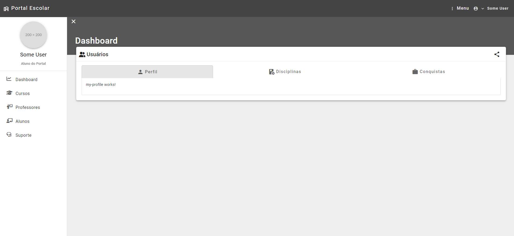
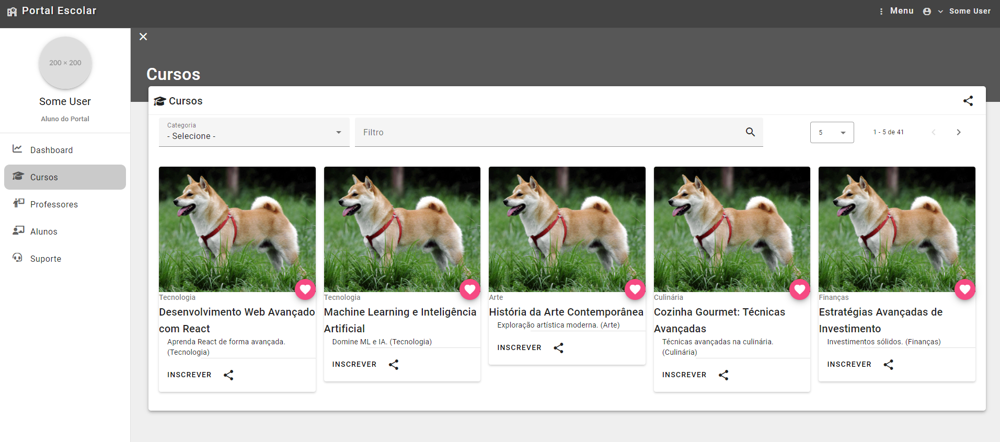
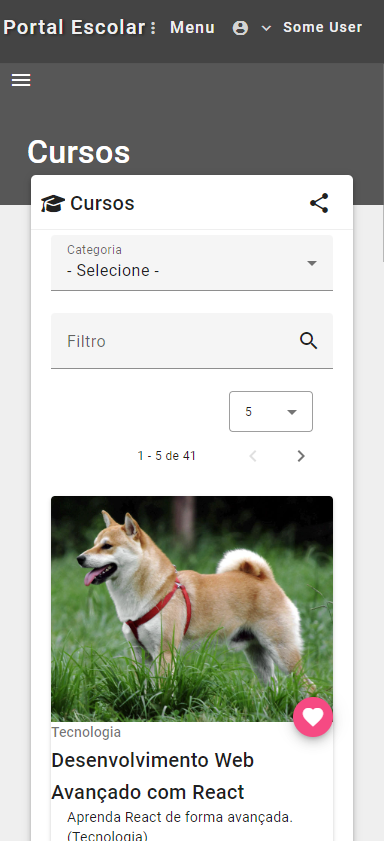
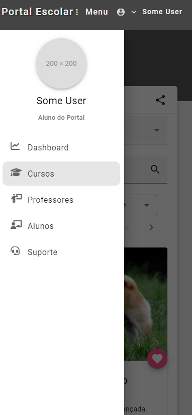

# School Portal
[![Angular][Angular.io]][Angular-url]

This is a simple mock project for practicing Angular. Feel free to use it.

## Images

## Technologies Used

- **Angular**: For building the user interface.
- **Node.js**: For creating a simple API using `json-server`.
- **RxJS**: For state management and asynchronous data manipulation.
- **@ngbracket/ngx-layout**: For flexible layout
- **Angular Material**: For responsive and accessible UI components.

[Angular.io]: https://img.shields.io/badge/Angular-DD0031?style=for-the-badge&logo=angular&logoColor=white
[Angular-url]: https://angular.io/

## Feel free to do whatever you want
Pull requests are welcome. For major changes, please open an issue first to discuss what you would like to change.

But Download and Test for your own. :P